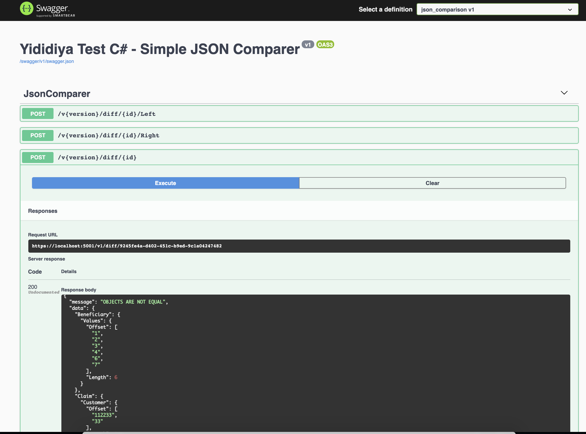

# Simple JSON Comparer - Yididiya 

> Hello RadioLiberty, here is a simple JSON Object Comparer API given the left and right hand of the equation/objects to compare (well the API accepts base64 stings of those Right/Left Objects).


## 📝 Note

The entire source code is purely the work of my hands, except that I have used Newtonsoft.json library heavily for manipulating JObjects.



As you can see from the swagger documentation, the API can actually compare from simple to complex JSON Objects. The inputs are shown below.

## Left Obj
```
{
  "Agent": "1289",
  "Beneficiary": {
    "Main": "true",
    "Values": [
      "1",
      "2",
      "3",
      "4",
      "5"
    ]
  },
  "BillingDate": "2021-04-04T13:33:03.969Z",
  "BillingInvoice": "914548",
  "Claim": {
    "Customer": "112233",
    "Products": [
      "one",
      "two",
      "three"
    ]
  }
}
```
## Right Obj
```
{
  "Agent": "1289",
  "Beneficiary": {
    "Main": "true",
    "Values": [
      "5",
      "6",
      "7"
    ]
  },
  "BillingDate": "2021-04-04T13:33:03.969Z",
  "BillingInvoice": "914548",
  "Claim": {
    "Customer": "33",
    "Products": [
      "one",
      "three",
      "six"
    ]
  }
}
```
## RESPONSE
```
{
  "message": "OBJECTS ARE NOT EQUAL",
  "data": {
    "Beneficiary": {
      "Values": {
        "Offset": [
          "1",
          "2",
          "3",
          "4",
          "6",
          "7"
        ],
        "Length": 6
      }
    },
    "Claim": {
      "Customer": {
        "Offset": [
          "112233",
          "33"
        ],
        "Length": 2
      },
      "Products": {
        "Offset": [
          "two",
          "six"
        ],
        "Length": 2
      }
    }
  }
}
```

## What is included

- API EndPoints
- Integration Tests
- Unit Test for the Core Functionality

## Limitations 

Just to save my time, throughout the code, I have assumed that I will only be dealing with JSON's with all values in String format (i.e {"input":"testValue"},both key & value inside quotes ) If this condition is not met an Exception of "OBJECTS_ARE_NOT_OF_SAME_SIZE" will be thrown for now.

This means, my solution will only work if JSON's properties (Key & Value) are given inside quotes, Otherwise I will have to run into the trouble of comparing all kinds of data types (Integer, Float, Boolean, Date, Raw, Bytes, Guid, Uri, TimeSpan).

The code also takes some assumptions during comparison of complex JSON objects. (i.e  when my recursive function encounters Array of Objects, I did treat these array of Object as if they have the same Data Structure / Anatomy, other wise it will be a whole lot of cross-product comparasion amongst these Array of unknown Data Stracture.)

## Suggestions for improvement 

- I would add validation at the time of JSON Object is Submitted for further Comparison (i.e /Left & /Right)
- Normally such kind of computation can be done in the background with a mesh of microserves computing the difference so as to save resources, that will also do away the latency that a user may experiance during v1/Diff/{id} calculation.
- etc

## Setup  
- Install [.NET 5.0.1](https://dotnet.microsoft.com/download/dotnet/5.0)
- Resotore Project
  ```bash
  > dotnet restore #at the root
  > dotnet build   #at the root

  > dotnet run   #at src/API

  > dotnet test   #at test/Api.IntegrationTests
  > dotnet test   #at test/Domain.Tests


